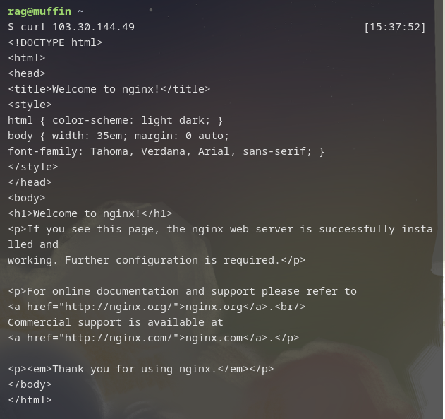
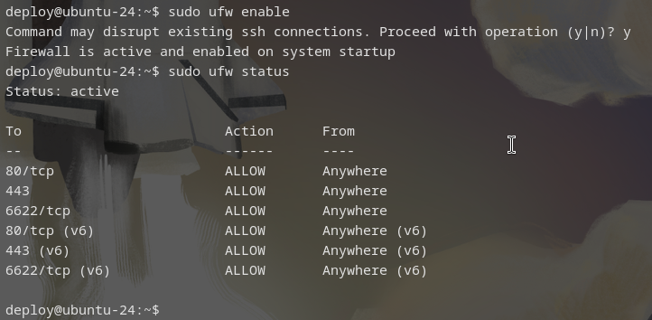
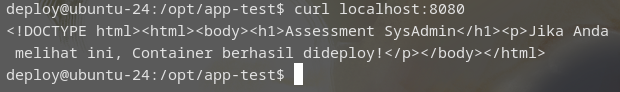

# Laporan Assessment - Imam Mansyur Solichin
## 1. Troubleshooting
- **Masalah:** Kesalahan konfigurasi Nginx (/etc/nginx/sites-enabled/default)
- **Solusi:** Melepas link dengan `sudo unlink /etc/nginx/sites-enabled/default`. Kemudian, saya edit `/etc/nginx/sites-available/default`, membenarkan typo, menambahkan `;` dan menambahkan `}` yang belum ada. Saya link kembali dengan command `sudo ln -s /etc/nginx/sites-available/default /etc/nginx/sites-enabled/`. Lalu, saya restart Nginx dengan `sudo systemctl reload nginx`.
- **Bukti:** 
## 2. Security

Pertama, saya melakukan konfigurasi ufw untuk allow pada http,https, dan 6622/tcp. kemudian saya enable dengan `sudo ufw enable` dan restart ufw daemon dengan `sudo systemctl restart ufw`.



Lalu, saya membuat user imam-admin. Pemilihan nama ini untuk memperjelas siapa dan role dari pengguna user ini. Command yang saya gunakan untuk membuat user dan menambahkan sebagai sudoer sebagai berikut:

```
# Membuat akun
sudo useradd imam-admin
# Menambahkan menjadi sudoer
sudo usermod -aG sudo imam-admin
```

Kemudian, pada `/etc/ssh/sshd_config`, saya mengganti `PermitRootLogin` menjadi `no` agar tidak bisa login ke root menggunakan SSH. Lalu, `PasswordAuthentication` saya ubah menjadi `no` agar tidak bisa login ke ssh menggunakan password untuk semua user. Kemudian saya cek baris 'includes' dan ternyata ada `50-cloud-init.conf` yang masih bertuliskan `PasswordAuthentication yes`. Saya ubah menjadi `no`. Kemudian, saya restart SSH dengan command:

```
sudo systemctl daemon-reload
sudo systemctl restart ssh.socket
```

~[SSH success](assets/ssh-success.png)

## 3. Containerization

Berikut Dockerfile yang saya buat:

```
FROM nginx:alpine
copy index.html /usr/share/nginx/html
```

Kemudian saya build menggunakan command:

```
sudo docker build -t app-test .
```
Dan saya jalankan dengan args `--restart unless-stopped` agar otomatis berjalan setelah restart. Command yang saya jalankan sebagai berikut:

```
sudo docker run --restart unless-stopped --name app-test -d -p 8080:80 app-test
```


## 4. Automation

Berikut bash script yang saya buat:

```
#!/bin/bash
# Create a log backup
tar --create --file /home/deploy/log-backup/log-backup-$(date -I).tar.gz /var/log/nginx

# Delete backups older than 7 days
rm -f $(find /home/deploy/log-backup -type f -name 'log-backup-*.tar.gz' -mtime +7)
```

Script tersebut saya simpan di /home/deploy/scripts/nginx-backup.sh. Lalu pada konfigurasi crontab:

```0 2 * * * sh /home/deploy/scripts/nginx-backup.sh```

## 5. Aplikasi Viral
Dengan banyaknya user yang mengakses website tersebut, diperlukan horizontal scaling pada server. Horizontal scaling yaitu penambahan server untuk mengakomodasi peningkatan beban pada satu server dengan membaginya dengan server lain.

Pada tiap server juga perlu diimplementasikan load balancer sebagai sistem untuk mendistribusikan beban ke seluruh server yang ada.

Caching juga diperlukan agar bagian aplikasi yang sering diakses dapat disimpan di cache dan digunakan kembali tanpa membebani database server.
